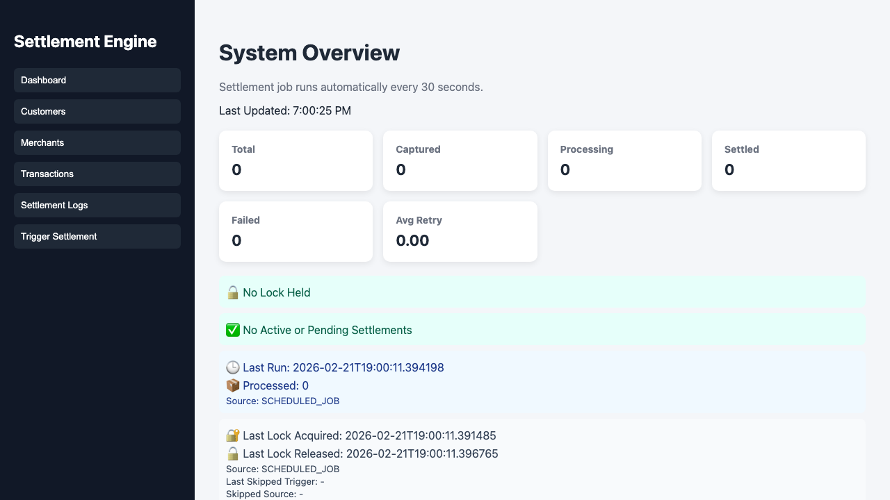
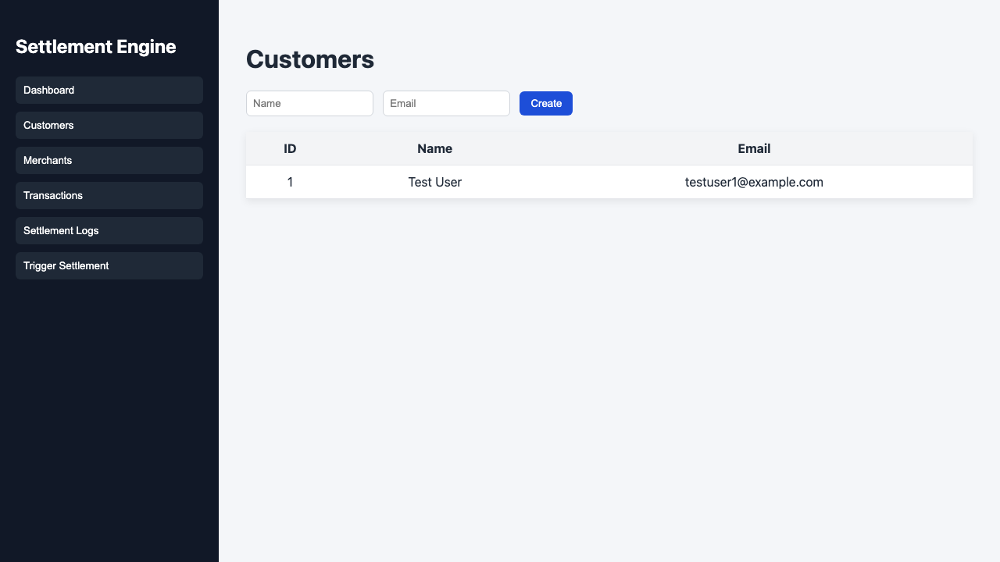
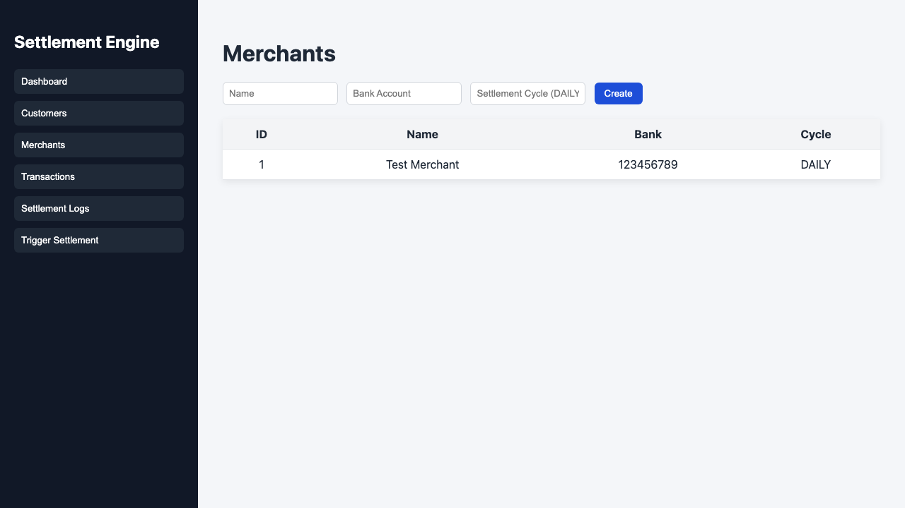
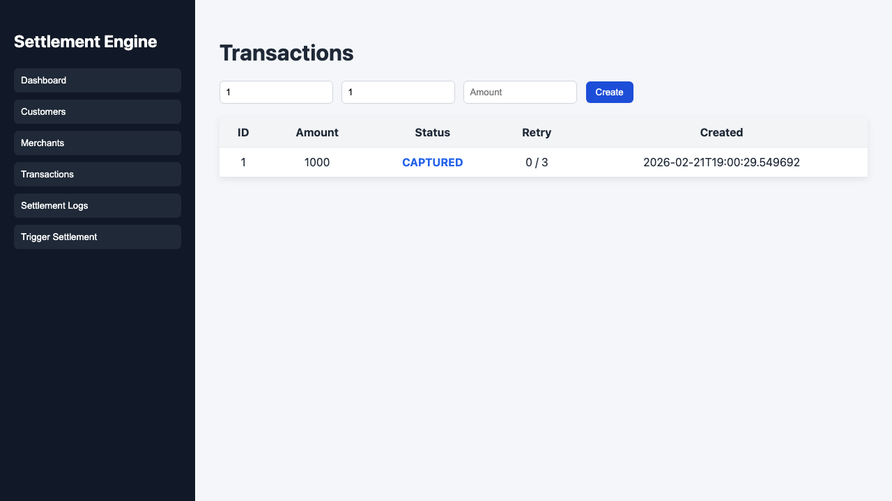
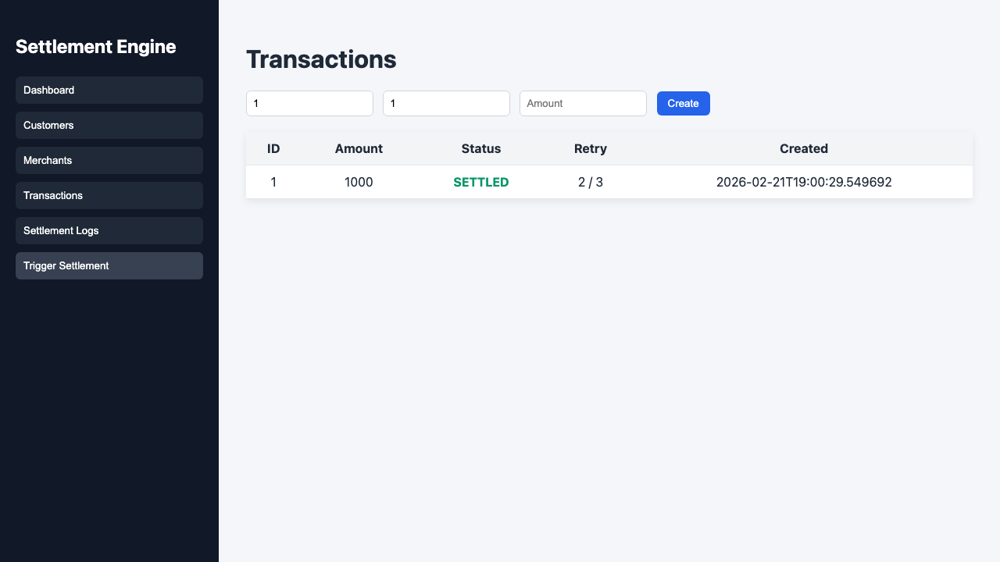
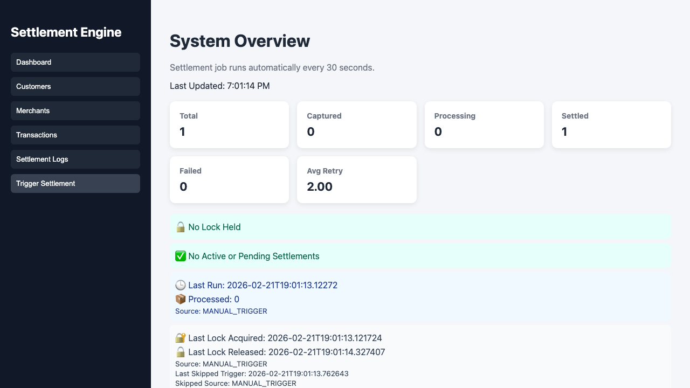
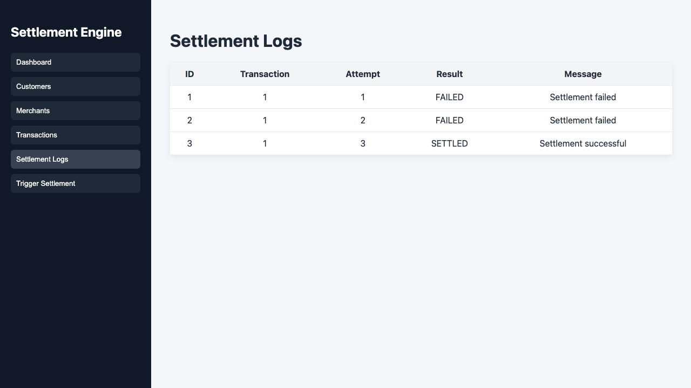

# Payment Settlement Engine

Payment Settlement Engine is a Spring Boot project that simulates a real settlement lifecycle:

- payment capture
- scheduled/manual settlement execution
- distributed lock protection
- retry and failure handling
- reconciliation and exception queue workflows
- role-based operational dashboard

It is designed as a portfolio-quality backend + frontend system that demonstrates reliability and operational behavior, not just CRUD APIs.

## Why This Project

Modern payment systems need strong guarantees:

- avoid duplicate settlement runs
- recover safely from partial processing
- support idempotent external triggers
- provide observability for operators
- enforce role-based access control

This project implements those concerns end-to-end with a browser UI and API surface.

## Core Features

- Customer and merchant onboarding
- Transaction creation in `CAPTURED` state
- Quartz-driven settlement scheduler (every 30 seconds)
- Manual settlement trigger API/UI
- Redis lock to guarantee a single active settlement runner
- Idempotent trigger behavior with `Idempotency-Key`
- Settlement logging per attempt
- Reconciliation pipeline with `PENDING`, `MATCHED`, `EXCEPTION_QUEUED`, `RESOLVED`
- Exception queue actions: retry and resolve
- Spring Security with `ADMIN` and `USER` roles

## State Transitions

### Settlement

```text
CAPTURED -> PROCESSING -> SETTLED
                 |
                 +-> CAPTURED (retry++)
                 +-> FAILED (max retries reached)
```

### Reconciliation

```text
PENDING -> MATCHED
PENDING -> EXCEPTION_QUEUED -> RESOLVED
PENDING -> EXCEPTION_QUEUED -> RETRY -> PENDING
```

## Tech Stack

- Java 17
- Spring Boot 4
- Spring Data JPA
- PostgreSQL
- Redis
- Quartz Scheduler
- Vanilla HTML/CSS/JS frontend
- Maven
- Playwright (E2E validation)

## Repository Structure

```text
src/main/java/com/kailas/settlementengine
  controller/      REST endpoints
  service/         settlement, lock, idempotency, reconciliation, monitoring
  scheduler/       Quartz config and job
  entity/          domain models and enums
  repository/      JPA repositories
  config/          Spring Security configuration

src/main/resources/static
  index.html       dashboard shell
  app.js           frontend behavior and API integration
  style.css        UI styling

scripts/
  playwright-validate.mjs  core settlement E2E flow
  role-validation.mjs      role-based admin/user E2E flow
```

## Quick Start

### 1. Clone

```bash
git clone <your-repo-url>
cd settlement-engine
```

### 2. Start Dependencies (Postgres + Redis)

```bash
docker compose up -d postgres redis
```

### 3. Configure Credentials (Recommended)

```bash
export APP_ADMIN_USERNAME=admin
export APP_ADMIN_PASSWORD='<your-admin-password>'
export APP_USER_USERNAME=user
export APP_USER_PASSWORD='<your-user-password>'
```

### 4. Run Application

```bash
./mvnw spring-boot:run
```

### 5. Open Dashboard

```text
http://localhost:8080
```

Login with the credentials you set in step 3.

## Auth and Roles

Two roles are supported:

- `ADMIN`: full read/write access (create/trigger/reconcile/exception actions)
- `USER`: read-only dashboards/tables; write APIs return `403`

For public demo access, share only the `USER` account. Keep `ADMIN` credentials private.

Auth endpoints:

- login form: `GET /login`, `POST /login`
- logout: `POST /logout`
- current identity: `GET /api/auth/me`

## Configuration

All runtime values are environment-variable driven.

### Core Runtime

| Variable | Purpose |
|---|---|
| `SPRING_DATASOURCE_URL` | Database JDBC URL |
| `SPRING_DATASOURCE_USERNAME` | Database username |
| `SPRING_DATASOURCE_PASSWORD` | Database password |
| `SPRING_DATA_REDIS_HOST` | Redis host |
| `SPRING_DATA_REDIS_PORT` | Redis port |
| `SPRING_DATA_REDIS_USERNAME` | Redis username (if required) |
| `SPRING_DATA_REDIS_PASSWORD` | Redis password (if required) |
| `PORT` | Runtime port (set automatically on Railway) |

### Security

| Variable | Purpose |
|---|---|
| `APP_ADMIN_USERNAME` | Admin username |
| `APP_ADMIN_PASSWORD` | Admin password |
| `APP_USER_USERNAME` | User username |
| `APP_USER_PASSWORD` | User password |

### Settlement Behavior

| Variable | Default | Notes |
|---|---|---|
| `SETTLEMENT_OUTCOME_MODE` | `RANDOM` | `RANDOM`, `ALWAYS_SUCCESS`, `ALWAYS_FAIL` |
| `SETTLEMENT_OUTCOME_RANDOM_SEED` | empty | Optional deterministic seed for `RANDOM` |
| `SETTLEMENT_TRIGGER_IDEMPOTENCY_TTL_SECONDS` | `600` | Trigger replay window |
| `SETTLEMENT_TRIGGER_IDEMPOTENCY_WAIT_TIMEOUT_MILLIS` | `5000` | Wait timeout for in-flight duplicate key |

## API Summary

### Customers

- `GET /customers`
- `POST /customers` (`ADMIN`)

### Merchants

- `GET /merchants`
- `POST /merchants` (`ADMIN`)

### Transactions

- `GET /transactions`
- `POST /transactions?customerId={id}&merchantId={id}&amount={value}` (`ADMIN`)

### Settlement

- `POST /settlement/trigger` (`ADMIN`)
- Optional request header: `Idempotency-Key: <value>`

### Monitoring

- `GET /api/settlements/stats`

### Logs

- `GET /logs`

### Reconciliation

- `GET /api/reconciliation/exceptions`
- `POST /api/reconciliation/run` (`ADMIN`)
- `POST /api/reconciliation/exceptions/{transactionId}/retry` (`ADMIN`)
- `POST /api/reconciliation/exceptions/{transactionId}/resolve` (`ADMIN`)

Resolve payload:

```json
{ "note": "Manually verified and closed" }
```

## Frontend Screens

### Dashboard

Live totals, lock state, queue state, and run metadata.



### Customer and Merchant Management




### Transaction Lifecycle




### Lock and Audit




### Idempotency



## Testing

### Backend Unit/Integration Tests

```bash
./mvnw test
```

### Core Playwright E2E Flow

```bash
npm install
BASE_URL=http://localhost:8080 \
SCREENSHOT_DIR=playwright-screenshots \
node scripts/playwright-validate.mjs
```

### Role-Based Playwright E2E Flow

```bash
BASE_URL=http://localhost:8080 \
ADMIN_USERNAME=admin \
ADMIN_PASSWORD='<admin-password>' \
USER_USERNAME=user \
USER_PASSWORD='<user-password>' \
node scripts/role-validation.mjs
```

## Deployment (Railway)

Live app URL:

- `https://settlement-engine-production.up.railway.app`

### Public Demo Login (Read-Only)

Use this account to explore the deployed dashboard safely:

- Username: `user`
- Password: `user123`

Admin credentials are intentionally not documented in this README.

Required services:

- PostgreSQL
- Redis

Required app variables:

- `SPRING_DATASOURCE_URL`
- `SPRING_DATASOURCE_USERNAME`
- `SPRING_DATASOURCE_PASSWORD`
- `SPRING_DATA_REDIS_HOST`
- `SPRING_DATA_REDIS_PORT`
- `SPRING_DATA_REDIS_USERNAME`
- `SPRING_DATA_REDIS_PASSWORD`
- `APP_ADMIN_USERNAME`
- `APP_ADMIN_PASSWORD`
- `APP_USER_USERNAME`
- `APP_USER_PASSWORD`

## Troubleshooting

### Reconciliation fails in UI

Check:

- backend logs for detailed error
- Redis connectivity
- datasource credentials

### Logout page looks stale

Hard refresh browser assets after deploy:

- macOS: `Cmd + Shift + R`

### App crashes on Railway startup

Most common causes:

- missing `SPRING_DATASOURCE_*`
- missing `SPRING_DATA_REDIS_*`
- missing `APP_ADMIN_PASSWORD` / `APP_USER_PASSWORD`

## Current Status

Working and validated end-to-end:

- settlement processing and retries
- distributed locking
- idempotent trigger handling
- reconciliation + exception queue
- role-based frontend/backend access control
- dashboard operational visibility
