# Settlement Engine

[](https://adoptium.net/)
[](https://spring.io/projects/spring-boot)
[](#testing)
[-457b9d)](#testing)

A production-style payment settlement simulation focused on correctness, operational safety, and observability.

The project demonstrates the full lifecycle of customer/merchant transactions with:
- scheduled + manual settlement execution
- Redis locking for single-run safety
- idempotent trigger behavior
- reconciliation and exception handling
- role-based access (admin and user)

## Why This Project Exists

Most demos show payment status updates. This one focuses on **operational correctness under contention and retries**:
- What happens when scheduler and manual trigger collide?
- What happens when the same trigger request is retried?
- What happens when settlement keeps failing for a transaction?
- How do operators see and resolve exceptions safely?

The implementation emphasizes these questions as first-class design concerns.

## Quick Navigation

- [Live Demo](#live-demo)
- [UI Preview](#ui-preview)
- [Engineering Invariants](#engineering-invariants)
- [Formal State Model](#formal-state-model)
- [System Architecture](#system-architecture)
- [Core Execution Flows](#core-execution-flows)
- [Data Model](#data-model)
- [Design Decisions and Rationale](#design-decisions-and-rationale)
- [Failure Modes and Handling](#failure-modes-and-handling)
- [Telemetry and Logging](#telemetry-and-logging)
- [API Summary](#api-summary)
- [Local Development](#local-development)
- [Deployment (Railway)](#deployment-railway)

## Live Demo

- **URL:** https://settlement-engine-production.up.railway.app
- **Demo User (read-only):**
  - Username: `user`
  - Password: `user123`

Admin credentials are intentionally private.

## UI Preview

### Authentication

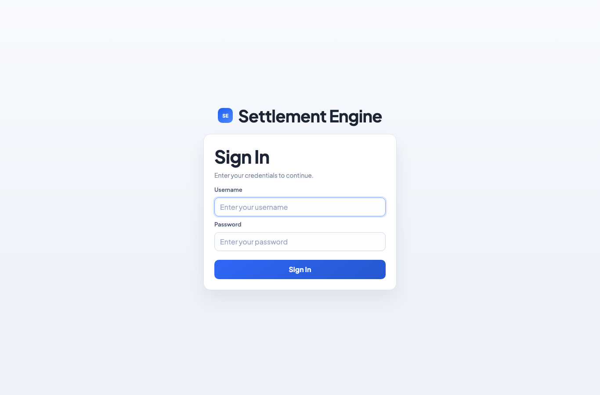

### Dashboard

| Admin Dashboard | User Dashboard |
|---|---|
| 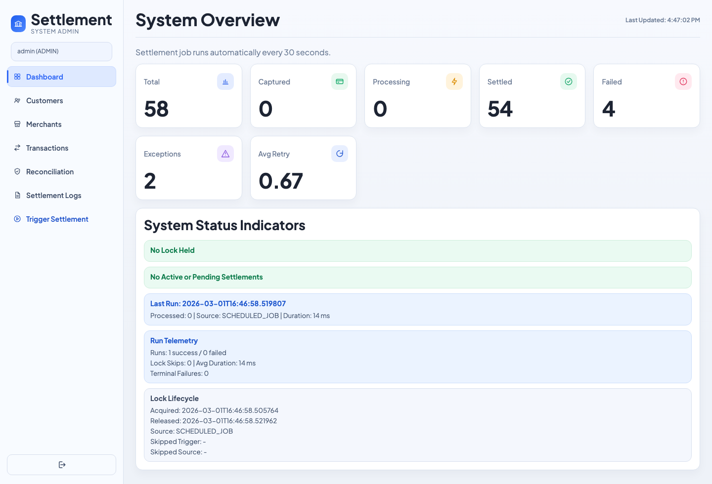 |  |

### Core Pages

| Customers | Merchants |
|---|---|
| 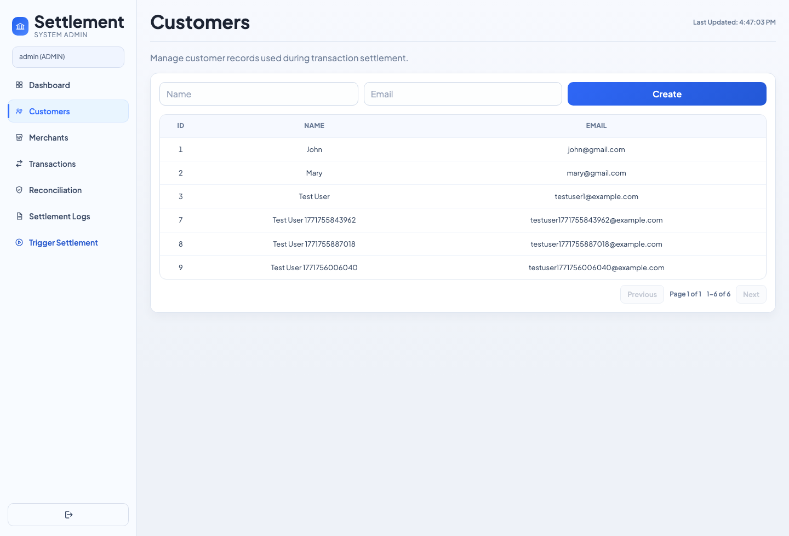 | 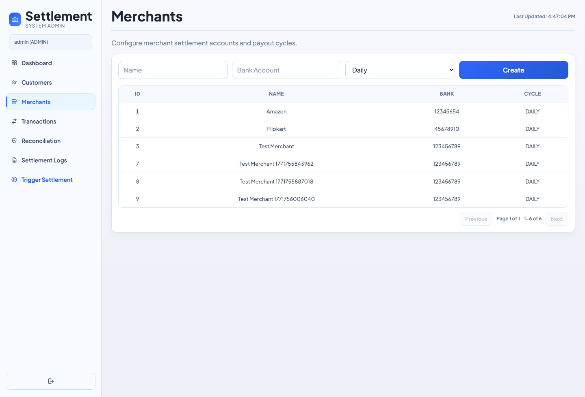 |

| Transactions | Reconciliation |
|---|---|
| 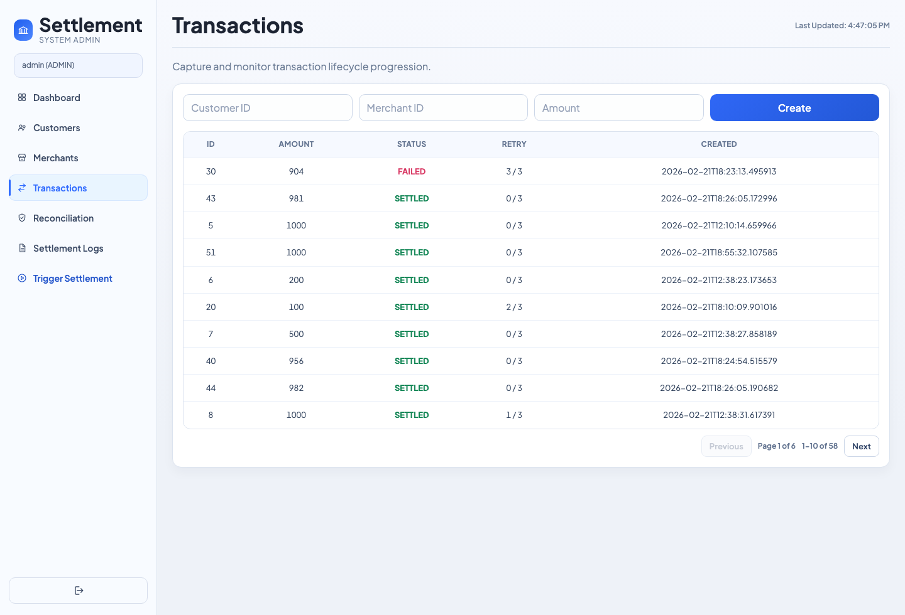 | 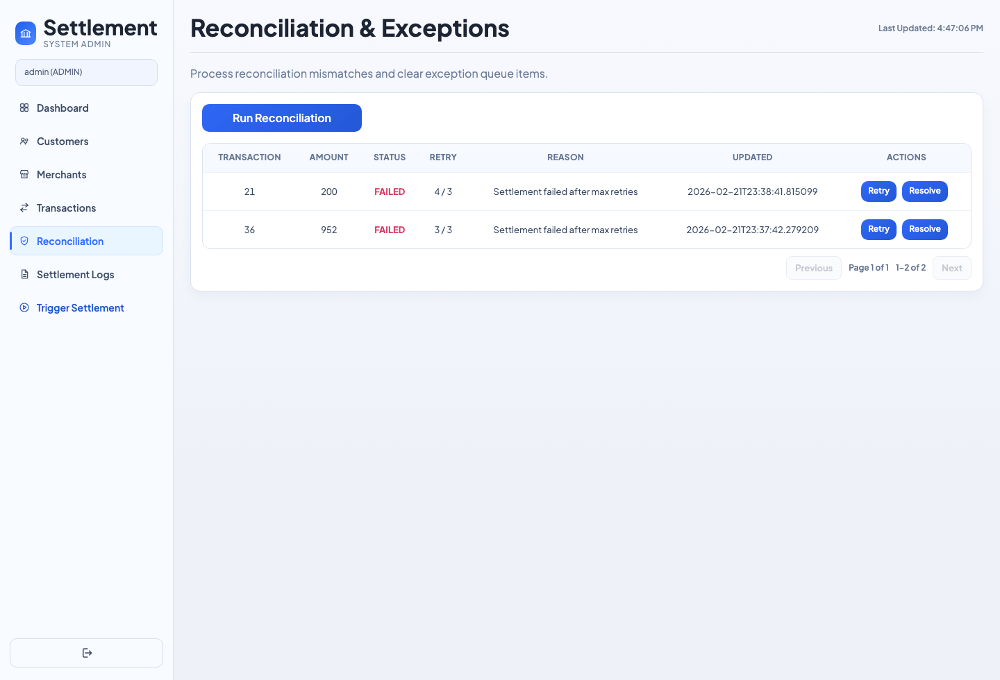 |

| Settlement Logs |
|---|
| 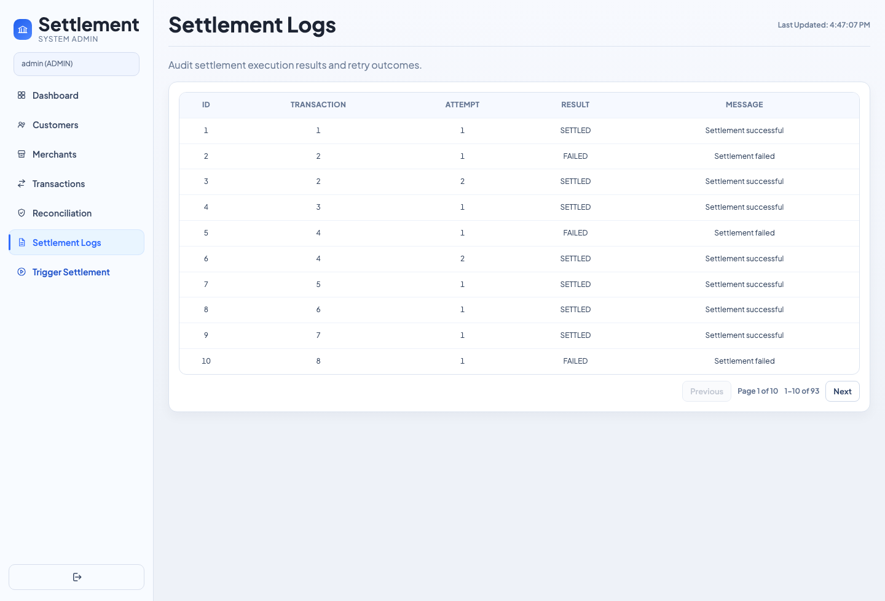 |

## Engineering Invariants

- **At-most-one active settlement executor**
  - Redis lock ensures scheduler/manual triggers never run settlement concurrently.
- **Idempotent manual trigger semantics**
  - Duplicate trigger requests with the same key resolve to one execution outcome (within the same app instance and TTL window).
- **Deterministic transaction lifecycle**
  - `CAPTURED -> PROCESSING -> SETTLED | FAILED`, with bounded retries.
- **Explicit exception operations**
  - Failures crossing retry limit are queued for reconciliation actions (`retry` / `resolve`).
- **Server-side authorization as source of truth**
  - RBAC is enforced on backend endpoints regardless of UI behavior.
- **Auditable runtime state**
  - Lock lifecycle, run source, counts, and settlement logs are queryable in UI/API.

## Formal State Model

### Allowed Transaction Status Transitions

| From | To | Trigger |
|---|---|---|
| `CAPTURED` | `PROCESSING` | Claim step before processing |
| `PROCESSING` | `SETTLED` | Successful settlement attempt |
| `PROCESSING` | `CAPTURED` | Failed attempt with retries remaining |
| `PROCESSING` | `FAILED` | Failed attempt at max retries |
| `FAILED` | `CAPTURED` | Operator retry from exception queue |

Transitions outside this matrix are rejected by backend guard logic (`TransactionStateMachine`) with an `IllegalStateException`.

### Illegal Transition Protection

- Claiming is protected at DB level with conditional update (`WHERE status='CAPTURED'`).
- Service-layer transitions are validated centrally before mutation.
- Reconciliation retry moves `FAILED -> CAPTURED` through the same guard path.

## Tech Stack

- Java 17
- Spring Boot 4
- Spring Data JPA
- Spring Security
- Quartz Scheduler
- PostgreSQL
- Redis
- HTML / CSS / Vanilla JavaScript
- Maven
- Playwright (validation scripts)

## System Architecture

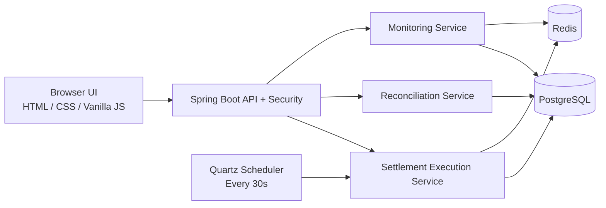

## Core Execution Flows

### Settlement Trigger Sequence

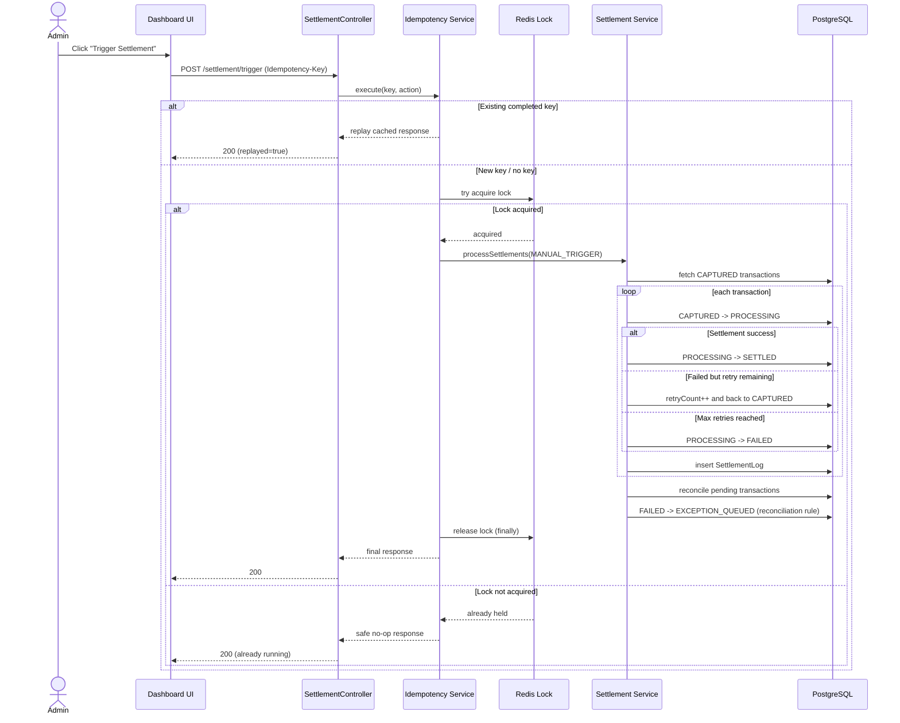

### Lock Acquisition Flow

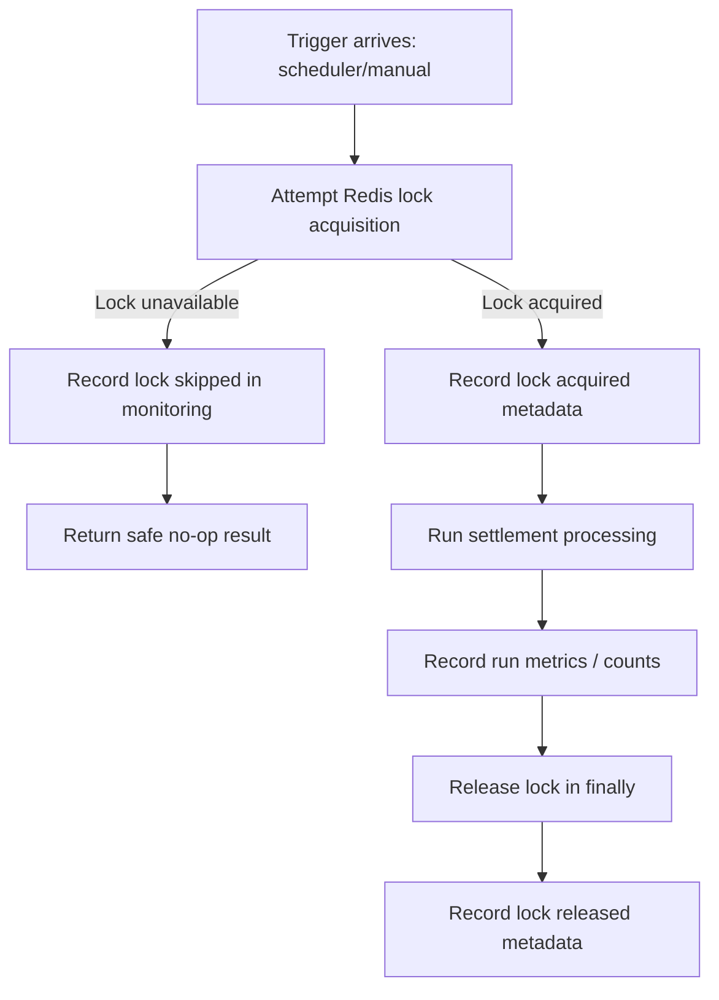

### Retry and Exception Flow

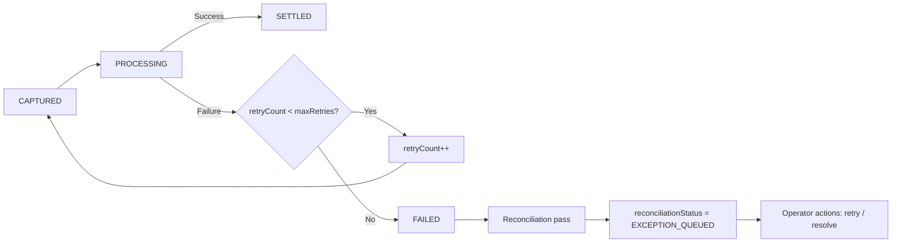

### Idempotency Strategy (Manual Trigger)

This system applies idempotency specifically to `POST /settlement/trigger` to make manual operations safe under retries and repeated clicks.
The idempotency cache is maintained in-memory inside the running application process.

- With no `Idempotency-Key`, the trigger executes normally.
- With a key:
  - First request executes and stores response for a TTL window.
  - Concurrent duplicate requests with the same key wait for the in-flight result (up to configured timeout).
  - Subsequent duplicates replay the same stored response instead of re-running settlement.
- Scope note: this behavior is guaranteed per app instance (not a distributed shared idempotency store).
- This avoids duplicate operational side effects while keeping API behavior deterministic for clients.

## Data Model

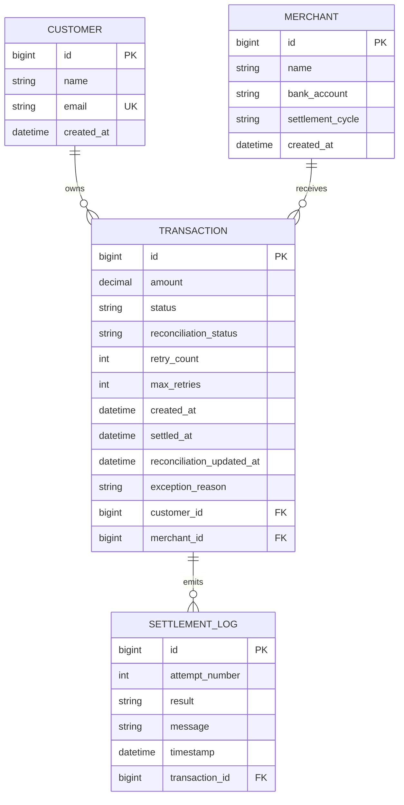

## Design Decisions and Rationale

| Decision | Why it was chosen | What it prevents |
|---|---|---|
| Redis distributed lock for settlement execution | Scheduler and manual trigger can overlap in real systems; lock enforces single active runner | Double-processing and inconsistent state transitions |
| In-memory idempotency for manual trigger endpoint | Operators and clients can retry requests; response replay gives deterministic behavior per app instance | Duplicate side-effects from repeated trigger calls within the same instance |
| Explicit `CAPTURED -> PROCESSING` claim before outcome | Makes ownership and in-flight state visible and auditable | Ambiguous transaction ownership during execution |
| Bounded retry with terminal `FAILED` + exception queue | Distinguishes transient failures from cases requiring operator action | Infinite retry loops and silent failure accumulation |
| Reconciliation modeled as explicit workflow | Keeps mismatch handling observable and controlled by ops actions | Hidden data integrity drift over time |
| Backend-enforced RBAC (UI is secondary) | Security policy must hold even if frontend is bypassed | Privilege escalation through client-side manipulation |

## Failure Modes and Handling

| Failure Mode | Expected Behavior | Why this is acceptable |
|---|---|---|
| Trigger arrives while another run is active | Lock acquisition fails; request returns safe no-op/already-running response | Preserves single-writer safety over throughput |
| Duplicate manual trigger with same `Idempotency-Key` | Existing/in-flight result is replayed rather than re-executed | Prevents duplicate side-effects on retries |
| Settlement attempt fails but retries remain | Transaction returns to `CAPTURED`, `retryCount` increments | Allows transient recovery without manual intervention |
| Settlement fails after max retries | Transaction moves to `FAILED`, then reconciliation marks it `EXCEPTION_QUEUED` | Escalates to controlled operator workflow |
| Unauthorized write attempt from USER role | Backend returns `403` | Security does not depend on frontend controls |

## Telemetry and Logging

Operational counters/timers are tracked in `SettlementMonitoringService` and surfaced via:
- `GET /api/settlements/stats`

Tracked telemetry includes:
- Status counts: `captured`, `processing`, `settled`, `failed`, `exceptionQueued`
- Run counters: `runCountTotal`, `runSuccessTotal`, `runFailureTotal`, `lockSkippedTotal`
- Throughput/outcomes: `processedTransactionsTotal`, `settledTransactionsTotal`, `retriedTransactionsTotal`, `terminalFailedTransactionsTotal`
- Timing: `lastRunDurationMillis`, `averageRunDurationMillis`
- Lock lifecycle and latest run context (`lastLockAcquiredAt`, `lastLockReleasedAt`, `lastRunSource`, etc.)

Logging is emitted via SLF4J using structured event keys (`event=...`) for lock lifecycle, run completion/failure, settlement attempts, and reconciliation actions.

## Scope and Non-Goals

- This project models **settlement orchestration behavior**, not external processor integrations.
- It does not implement payment gateway protocols or bank file formats.
- It prioritizes **correctness and observability** over horizontal scale optimization.

## Roles and Access

- **ADMIN**
  - Can create customers/merchants/transactions
  - Can trigger settlement
  - Can run reconciliation and perform retry/resolve actions
- **USER**
  - Read-only access to dashboard and data tables

### Auth Endpoints

- `GET /login.html`
- `POST /login`
- `POST /logout`
- `GET /api/auth/me`

## Frontend Notes

- Custom sign-in page (`login.html`).
- Responsive admin dashboard layout.
- Dashboard status panel now includes run telemetry highlights (success/failure runs, lock skips, average run duration, terminal failures).
- Table pagination is enabled across list pages with **max 10 rows per page**.
- UI branding and role label adapt to current logged-in role.

## API Summary

### Customers
- `GET /customers`
- `POST /customers` (ADMIN)

### Merchants
- `GET /merchants`
- `POST /merchants` (ADMIN)

### Transactions
- `GET /transactions`
- `POST /transactions?customerId={id}&merchantId={id}&amount={value}` (ADMIN)

### Settlement
- `POST /settlement/trigger` (ADMIN)
- Supports `Idempotency-Key` header

### Monitoring
- `GET /api/settlements/stats`

### Logs
- `GET /logs`

### Reconciliation
- `GET /api/reconciliation/exceptions`
- `POST /api/reconciliation/run` (ADMIN)
- `POST /api/reconciliation/exceptions/{transactionId}/retry` (ADMIN)
- `POST /api/reconciliation/exceptions/{transactionId}/resolve` (ADMIN)

Resolve request body:

```json
{ "note": "Manually verified and closed" }
```

## Local Development

### 1. Clone

```bash
git clone https://github.com/Kailas2004/settlement-engine.git
cd settlement-engine
```

### 2. Start Dependencies

```bash
docker compose up -d postgres redis
```

### 3. Configure Credentials

```bash
export APP_ADMIN_USERNAME=admin
export APP_ADMIN_PASSWORD='<your-admin-password>'
export APP_USER_USERNAME=user
export APP_USER_PASSWORD='<your-user-password>'
```

### 4. Run App

```bash
./mvnw spring-boot:run
```

### 5. Open

```text
http://localhost:8080
```

## Environment Variables

### Core Runtime

| Variable | Purpose |
|---|---|
| `SPRING_DATASOURCE_URL` | PostgreSQL JDBC URL |
| `SPRING_DATASOURCE_USERNAME` | DB username |
| `SPRING_DATASOURCE_PASSWORD` | DB password |
| `SPRING_DATA_REDIS_HOST` | Redis host |
| `SPRING_DATA_REDIS_PORT` | Redis port |
| `SPRING_DATA_REDIS_USERNAME` | Redis username (optional) |
| `SPRING_DATA_REDIS_PASSWORD` | Redis password (optional) |
| `PORT` | Server port (Railway sets automatically) |

### Security

| Variable | Purpose |
|---|---|
| `APP_ADMIN_USERNAME` | Admin username |
| `APP_ADMIN_PASSWORD` | Admin password |
| `APP_USER_USERNAME` | User username |
| `APP_USER_PASSWORD` | User password |

### Settlement / Idempotency

| Variable | Default | Notes |
|---|---|---|
| `SETTLEMENT_OUTCOME_MODE` | `RANDOM` | `RANDOM`, `ALWAYS_SUCCESS`, `ALWAYS_FAIL` |
| `SETTLEMENT_OUTCOME_RANDOM_SEED` | empty | Optional deterministic seed |
| `SETTLEMENT_TRIGGER_IDEMPOTENCY_TTL_SECONDS` | `600` | Replay window |
| `SETTLEMENT_TRIGGER_IDEMPOTENCY_WAIT_TIMEOUT_MILLIS` | `5000` | Wait for in-flight duplicate |

## Testing

### Backend

```bash
./mvnw test
```

### Coverage Report (JaCoCo)

```bash
./mvnw verify
```

Report output:

```text
target/site/jacoco/index.html
```

### Test Focus Areas

- Deterministic outcome behavior and invalid config handling
- Reconciliation success/failure/resolve/retry paths (including negative assertions)
- Idempotency semantics including concurrent same-key execution
- Controller-level idempotent trigger behavior

### E2E Validation

```bash
npm install
BASE_URL=http://localhost:8080 \
SCREENSHOT_DIR=playwright-screenshots \
node scripts/playwright-validate.mjs
```

## Deployment (Railway)

This project is designed to auto-deploy on Railway from the connected GitHub branch.

- Push to your deploy branch.
- Railway rebuilds and updates the **same service URL**.
